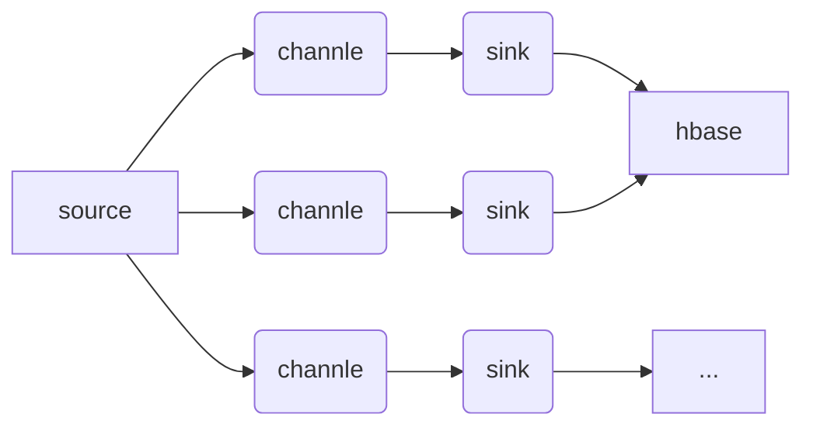
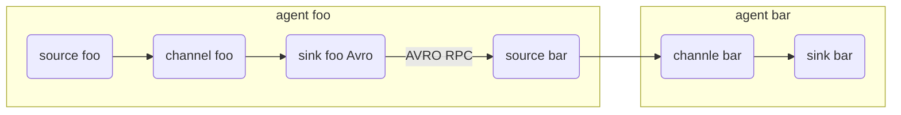
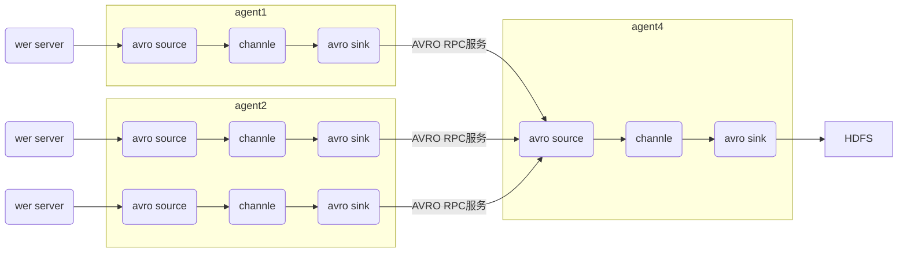

### flume 的一些核心概念
- Client：Client生产数据，运行在一个独立的线程。
- Event： 一个数据单元，消息头和消息体组成。（Events可以是日志记录、 avro 对象等。）
- Flow： Event从源点到达目的点的迁移的抽象。
- Agent： 一个独立的Flume进程，包含组件Source、 Channel、 Sink。（Agent使用JVM 运行Flume。每台机器运行一个agent，但是可以在一个agent中包含多个sources和sinks。）
- Source： 数据收集组件。（source从Client收集数据，传递给Channel）
- Channel： 中转Event的一个临时存储，保存由Source组件传递过来的Event。（Channel连接 sources 和 sinks ，这个有点像一个队列。）
- Sink： 从Channel中读取并移除Event， 将Event传递到FlowPipeline中的下一个Agent（如果有的话）（Sink从Channel收集数据，运行在一个独立线程。）
#### agent 结构
Flume 运行的核心是 Agent。Flume以agent为最小的独立运行单位。一个agent就是一个JVM。它是一个完整的数据收集工具，含有三个核心组件，分别是source、 channel、 sink。通过这些组件， Event 可以从一个地方流向另一个地方，如下图所示。


#### source
Source是数据的收集端，负责将数据捕获后进行特殊的格式化，将数据封装到事件（event） 里，然后将事件推入Channel中。 Flume提供了很多内置的Source， 支持 Avro， log4j， syslog 和 http post(body为json格式)。可以让应用程序同已有的Source直接打交道，如AvroSource，SyslogTcpSource。 如果内置的Source无法满足需要， Flume还支持自定义Source。


source 类型

| Source 类型 | 说明 |
| ---------- | ---- |
| Avro Source | 支持Avro协议(实际是Avro RPC), 内置支持 |
| Thrift Source | 支持Thrift协议, 内置支持 |
| Exec Source | 基于Unix的command在标准输出上生产数据 |
| JMS Source | 从JMS系统中读取数据 |
| Spooling Directory Source | 监控指定目录内数据变更 |
| Netcat Source | 监控某个端口,将经流端口的没一个文本行数据作为event输入 |
| Syslog Source | 读取syslog数据,产生event,支持udp和tcp两种协议 |
| HTTP Source | 基于HTTP POST 或 GET 方式的数据u源, 支持JSON, BLOB表示形式 |
| Legacy Source | 兼容老的flume OG中的Source |

#### channel
Channel是连接Source和Sink的组件，大家可以将它看做一个数据的缓冲区（数据队列），它可以将事件暂存到内存中也可以持久化到本地磁盘上， 直到Sink处理完该事件。介绍两个较为常用的Channel， MemoryChannel和FileChannel。

| channel 类型 | 说明 |
| -----------  | --- |
| Memory Channel | Event数据存储在内存中 |
| JDBC Channel | Event数据存储在持久化存储中 |
| File Channel | Event数据存储在磁盘文件中 |
| Custom Channel | 自定义Channel实现 | 

#### sink
Sink从Channel中取出事件，然后将数据发到别处，可以向文件系统、数据库、 hadoop存数据， 也可以是其他agent的Source。在日志数据较少时，可以将数据存储在文件系统中，并且设定一定的时间间隔保存数据。


sink 类型

| sink 类型 | 说明 |
| -------- | ---- |
| HDFS Sink | 数据写入HDFS |
| Logger Sink | 数据写入日志文件 |
| Avro Sink | 数据转换成Avro Event, 然后发送到配置的RPC端口上 |
| Thrift Sink | 数据转换成Thrift Event, 然后发送到配置的RPC端口上 | 
| IRC Sink | 数据在IRC上进行回放 |
| File Roll Sink | 数据存放到本地文件系统 |
| Null Sink | 丢弃所有数据 }
| HBase Sink | 数据写入HBase数据库 |
| Hive Sink | 数据写入Hive数据库 |
| ElasticSearch Sink | 数据发送到ES搜索服务器(集群)
| Custom Sink | 自定义Sink实现 |
 
### flume 拦截器,数据流,可靠性
#### flume 拦截器(Interceptor)
当我们需要对数据进行过滤时，除了我们在Source、 Channel和Sink进行代码修改之外， Flume为我们提供了拦截器，拦截器也是chain形式的。拦截器的位置在Source和Channel之间，当我们为Source指定拦截器后，我们在拦截器中会得到event，根据需求我们可以对event进行保留还是抛弃，抛弃的数据不会进入Channel中。 

#### flume 数据流
1. Flume 的核心是把数据从数据源收集过来，再送到目的地。为了保证输送一定成功，在送到目的地之前，会先缓存数据，待数据真正到达目的地后，删除自己缓存的数据。

2. Flume 传输的数据的基本单位是 Event，如果是文本文件，通常是一行记录，这也是事务的基本单位。 Event 从 Source，流向 Channel，再到 Sink，本身为一个 byte 数组，并可携带 headers 信息。 Event 代表着一个数据流的最小完整单元，从外部数据源来，向外部的目的地去。



   值得注意的是，Flume提供了大量内置的Source、Channel和Sink类型。不同类型的Source,Channel和Sink可以自由组合。组合方式基于用户设置的配置文件，非常灵活。比如：Channel可以把事件暂存在内存里，也可以持久化到本地硬盘上。Sink可以把日志写入HDFS, HBase，甚至是另外一个Source等等。Flume支持用户建立多级流，也就是说，多个agent可以协同工作，并且支持Fan-in、Fan-out、Contextual Routing、Backup Routes，这也正是Flume强大之处。如下图所示：


#### flume 可靠性

　　Flume 使用事务性的方式保证传送Event整个过程的可靠性。 Sink 必须在Event 被存入 Channel 后，或者，已经被传达到下一站agent里，又或者，已经被存入外部数据目的地之后，才能把 Event 从 Channel 中 remove 掉。这样数据流里的 event 无论是在一个 agent 里还是多个 agent 之间流转，都能保证可靠，因为以上的事务保证了 event 会被成功存储起来。比如 Flume支持在本地保存一份文件 channel 作为备份，而memory channel 将event存在内存 queue 里，速度快，但丢失的话无法恢复。

### flume 使用场景

#### 多个agent顺序连接



   可以将多个Agent顺序连接起来，将最初的数据源经过收集，存储到最终的存储系统中。这是最简单的情况，一般情况下，应该控制这种顺序连接的Agent 的数量，因为数据流经的路径变长了，如果不考虑failover的话，出现故障将影响整个Flow上的Agent收集服务。 

#### 多个agent汇集到同一个agent



   这种情况应用的场景比较多，比如要收集Web网站的用户行为日志， Web网站为了可用性使用的负载集群模式，每个节点都产生用户行为日志，可以为每个节点都配置一个Agent来单独收集日志数据，然后多个Agent将数据最终汇聚到一个用来存储数据存储系统，如HDFS上。

### flume 安装/配置/简单示例
#### 安装

```shell
wget http://archive-primary.cloudera.com/cdh5/cdh/5/flume-ng-1.6.0-cdh5.7.0.tar.gz
sudo tar -zxvf flume-ng-1.6.0-cdh5.7.0.tar.gz -C /usr/local/
sudo mv apache-flume-1.6.0-cdh5.7.0-bin/ flume
sudo chown -R hadoop:hadoop flume/
```

#### 配置
```shell
# ~/.bashrc
export FLUME_HOME=/usr/local/flume
export FLUME_CONF_DIR=$FLUME_HOME/conf 
export PATH=$PATH:$FLUME_HOME/bin

# $FLUME_CONF_DIR/flume-env.sh
export JAVA_HOME=/usr/local/jvm/java
FLUME_CLASSPATH="/usr/local/flume"
```

#### source 使用本地文件, sink 使用 hive 简单配置

1. 配置文件log-to-hive-sink-demo.conf
    ```shell
    a1.sources = r1
    a1.sinks = s1
    a1.channels = c1

    # Define a memory channel called ch1 on agent1
    a1.channels.c1.type = memory
    a1.channels.c1.capacity = 10000
    a1.channels.c1.transactionCapacity = 100

    # defind source monitor a file
    a1.sources.r1.type = exec
    a1.sources.r1.shell = /bin/bash -c
    a1.sources.r1.command = tail -F /tmp/a.log
    a1.sources.r1.threads=5

    # defind a logger sink
    a1.sinks.s1.type=hive
    a1.sinks.s1.hive.metastore=thrift://localhost:9083
    a1.sinks.s1.hive.database=test
    a1.sinks.s1.hive.table=flume_user
    a1.sinks.s1.serializer=DELIMITED
    a1.sinks.s1.serializer.delimiter="\t"
    a1.sinks.s1.serializer.serdeSeparator='\t'
    a1.sinks.s1.serializer.fieldnames=user_id,user_name,age

    a1.sources.r1.channels=c1
    a1.sinks.s1.channel=c1
    ```

2. hive 中创建表

    ```sql
    create table flume_user(
      user_id int,
      user_name string,
      age int
    )
    clustered by (user_id) into 2 buckets
    stored as orc;
    ```

3. 将 $HIVE_HOME/hcatalog/share/hcatalog 目录下的以下文件 cp 到 $FLUME_HOME/lib 下
    ```
    hive-hcatalog-core-2.1.0.jar
    hive-hcatalog-pig-adapter-2.1.0.jar
    hive-hcatalog-server-extensions-2.1.0.jar
    hive-hcatalog-streaming-2.1.0.jar
    ```

4. 启动hive metastore
    ```shell
    hive --service metastore
    ```

5. 启动 flume
    ```shell
    flume-ng agent --conf conf --conf-file conf/log-to-hive-sink-demo.conf --name a1 -Dflume.root.logger=INFO,console
    ```
    
6. 向 /tmp/a.log 中追加数据测试

    ```python
    import time
    for i in range(10):
        with open("/tmp/a.log", "a+") as f:
            f.write("{}\tname{}\t20\t\r\n")
        time.sleep(2)
    ```
    
    
### flume 编写自定义 interceptor

1. 安装maven
    ```shell
    wget http://mirrors.hust.edu.cn/apache/maven/maven-3/3.6.0/binaries/apache-maven-3.6.0-bin.tar.gz
    sudo tar -axvf apache-maven-3.6.0-bin.tar.gz -C /usr/local/
    cd /usr/local/
    sudo mv apache-maven-3.6.0/ maven
    sudo chown -R hadoop:hadoop maven/
    
    # ~/.bashrc
    # maven
    export MAVEN_HOME=/usr/local/maven
    export CLASSPATH=$CLASSPATH:$MAVEN_HOME/lib
    export PATH=$PATH:$MAVEN_HOME/bin
    
    mvn -v
    ```
2. 编译java文件

    pom.xml
    ```xml
    <?xml version="1.0" encoding="UTF-8"?>
    <project xmlns="http://maven.apache.org/POM/4.0.0"
        xmlns:xsi="http://www.w3.org/2001/XMLSchema-instance"
        xsi:schemaLocation="http://maven.apache.org/POM/4.0.0
        http://maven.apache.org/maven-v4_0_0.xsd">
        <modelVersion>4.0.0</modelVersion>
        <groupId>costominterceptor</groupId>
        <artifactId>intercepetor_v1</artifactId>
        <version>1.0</version>
        <properties> 
        <project.build.sourceEncoding>UTF-8</project.build.sourceEncoding> 
        </properties>
        <dependencies>
            <dependency>
                <groupId>org.apache.flume</groupId>
                <artifactId>flume-ng-core</artifactId>
                <version>1.6.0</version>
            </dependency>
            <dependency>
                <groupId>com.alibaba</groupId>
                <artifactId>fastjson</artifactId>
                <version>1.2.52</version>
            </dependency>
        </dependencies>
    </project>
    ```
    ```shell
    mvn clean package
    ```
    java 目录结构  project/src/main/java/...
    pom.xml 放在project目录下

3. 执行mvn 命令后生成一个target目录,下有jar包,将jar包放至 FLUME_HOME/lib 下
4. log-to-hive-sink-demo.conf
    ```
    a1.sources = r1
    a1.sinks = s1
    a1.channels = c1

    # Define a memory channel called ch1 on agent1
    a1.channels.c1.type = memory
    a1.channels.c1.capacity = 10000
    a1.channels.c1.transactionCapacity = 100

    # defind source monitor a file
    a1.sources.r1.type = exec
    a1.sources.r1.shell = /bin/bash -c
    a1.sources.r1.command = tail -n 0 -F /tmp/a.log
    a1.sources.r1.threads=5
    # source interceptor
    a1.sources.r1.interceptors=i1
    a1.sources.r1.interceptors.i1.type=flume.JsonToHiveInterceptor$Builder
    a1.sources.r1.interceptors.i1.param=parameter

    # defind a logger sink
    a1.sinks.s1.type=hive
    a1.sinks.s1.hive.metastore=thrift://localhost:9083
    a1.sinks.s1.hive.database=test
    a1.sinks.s1.hive.table=flume_user
    a1.sinks.s1.serializer=DELIMITED
    a1.sinks.s1.serializer.delimiter="\t"
    a1.sinks.s1.serializer.serdeSeparator='\t'
    a1.sinks.s1.serializer.fieldnames=user_id,user_name,age

    a1.sources.r1.channels=c1
    a1.sinks.s1.channel=c1
    ```
5. 运行flume
    ```shell
    flume-ng agent --conf conf --conf-file conf/log-to-hive-sink-demo.conf --name a1 -Dflume.root.logger-INFO,console
    ``` 


