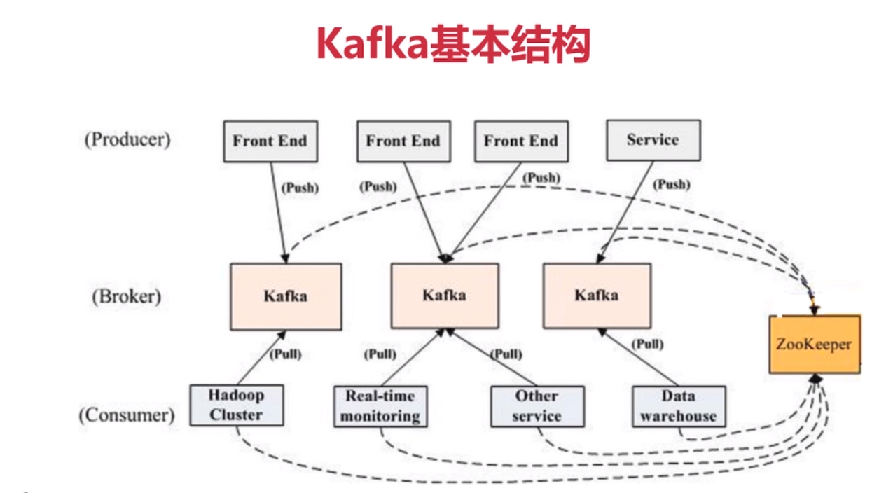

### 基础概念

- produce: 消息和数据的生产者, 向kafka的一个topic发送消息的进程/代码/服务
- consumer: 消息和数据的消费者, 订阅数据(topic)并且处理发布的消息的进程/代码/服务

#### 物理概念

- broker: kafka集群中的每个kafka节点
- partition: kafka下数据存储的基本单元, 一个topic数据, 会被分散存储到多个partition, 没一个partition是有序的
- replication(副本): 同一个partition会有多个replica, 多个replica之间的数据是一样的
- replication leader: 一个partition 的多个replica上, 需要一个leader负责该partition上producer与consumer交互
- replicaManager: 负责管理当前broker所有分区和副本的信息, 处理kafkaController发起的一些请求, 副本状态的切换, 添加/读取消息

#### 逻辑概念

- consumer group: 对于同一个topic, 会广播给不同的group, 一个group中,只有一个consumer可以消费该消息
- topic: kafka 消息的类别, 对数据进行区分,隔离

#### partition
- 每一个topic被切分成多个partition
- 消费者数目小于或等于partition数目
- broker group 中的每一个broker保存topic的一个或多个partition
- consumer group 中的仅有一个 consumer 读取topic的一个或多个partition, 并且是唯一的consumer

#### replication
- 当集群中有broker挂掉的情况, 系统可以主动的使replica提供服务
- 系统默认设置没一个topic 的replication系数为1, 可以在创建topic时单独设置

### kafka 基本结构



如上图所示，一个典型的Kafka集群中包含若干Producer（可以是web前端产生的Page View，或者是服务器日志，系统CPU、Memory等），若干broker（Kafka支持水平扩展，一般broker数量越多，集群吞吐率越高），若干Consumer Group，以及一个Zookeeper集群。Kafka通过Zookeeper管理集群配置，选举leader，以及在Consumer Group发生变化时进行rebalance。Producer使用push模式将消息发布到broker，Consumer使用pull模式从broker订阅并消费消息。


### kafka 基本操作
```shell
# 启动zookeeper
zookeeper-server-start.sh /usr/local/zookeeper/conf/zoo.cfg
zkServer.sh start /user/local/zookeeper/conf/zoo.cfg
# 启动kafka服务
kafka-server-start.sh /usr/local/kafka/config/server.properties
# 创建topic
kafka-topics.sh --create --topic mytopic --replication-factor 1 --partitions 3 --zookeeper localhost:2181 
# 查看topic列表
kafka-topics.sh --list --zookeeper localhost:2181
# 启动一个producer 发送消息
kafka-console-producer.sh --broker-list localhost:9092 --topic test 
# 启动一个consumer 接收消息
kafka-console-consumer.sh --bootstrap-server localhost:9092 --topic test --from-beginning
```
[python操作kafka](https://blog.csdn.net/luanpeng825485697/article/details/81036028)
